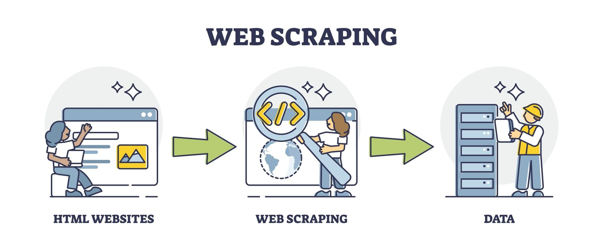

# Country Leaders Scraper



The Country Leaders Scraper is a Python script that gathers information about country leaders from 'https://country-leaders.onrender.com'. 
It performs web scraping to retrieve data on the leaders of 5 different nations: Belgium, France, Armenia, U.S. and Russia.
It also scrapes the first paragraph from each leader's Wikipedia page.
The scraper will create a leader.json file to save all the data retrieved from the scraping.
There is no way to let this scraper run on other url's ! So do not change any of the value's in the urls variable.

## Prerequisites

- Python 3.x
- Requests library (`pip install requests`)
- Beautiful Soup library (`pip install beautifulsoup4`)
## Usage/Installation

1. Clone the repository:

   ```shell
   git clone https://github.com/Sam-Veldeman/Wikipedia-Scrapper

2. Navigate to the project directory:
   ```shell
   cd country-leaders-scraper

3. Install the required dependencies:
   ```shell
   pip install -r requirements.txt

4. Run the scraper:
   ```shell
   python main.py

The scraper will start scraping the website and gather data.
When finished, the data will be stored in the project directory as 'leaders.json'.
Lastely, a counter of how many 'records' are in the file will be displayed.

## Timeline

This was a big learning curve for me, I've spend 3 days working on it.
I couldn't have done it without the help from all my co-students and coaches @BeCode.org

## Personal

Hi all! My name is Sam Veldeman, I'm a junior data scientist/analyst @BeCode.org.
I'm still in training now, following the AI bootcamp.
This project was done as part of the bootcamp.

If you would like to contact me:

My github: https://github.com/Sam-Veldeman

My LinkedIn: https://www.linkedin.com/in/sam-veldeman-b0307b233/


## Contributing

Special thanks to Félicien, Myko, Sam, Enrique and Daniel (and the coaches ofcourse!) for pointing me in the wright direction when feeling stuck.
